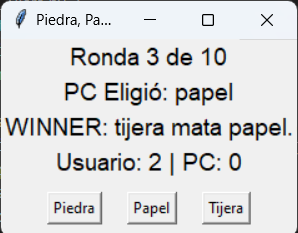
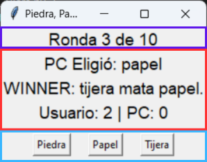
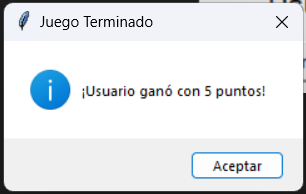

# Piedra_Papel_o_Tijera


<figure style="text-align: center;">
  
  <figcaption><strong></strong></figcaption>
</figure>

## **Índice**
1. [**Descripción**](#descripción)
2. [**Instalación**](#instalación)
3. [**Herramientas Utilizadas**](#herramientas-utilizadas)
4. [**Uso**](#uso)
5. [**Estructura del Código**](#estructura-del-código)
6. [**Requisitos**](#requisitos)
7. [**Licencia**](#licencia)
8. [**Autor**](#autor)

## **Descripción**
Este código implementa el código viejo de "Piedra, Papel o Tijera" pasándolo a Tkinter, donde el usuario compite contra la computadora en diez rondas. Cada ronda permite al usuario seleccionar una opción (piedra, papel o tijera), y el programa determina el ganador basado en las reglas del juego.

## **Instalación**

1. Asegúrate de tener **Python 3.12** o superior instalado en tu sistema.
2. Instala **Git** si aún no lo tienes.
3. Clona el repositorio desde GitHub con el siguiente comando:
   ```bash
    https://github.com/Mogollo7/Piedra_Papel_o_Tijera.git   
    ```

## **Herramientas Utilizadas**

- **Tkinter**: Biblioteca estándar para crear interfaces gráficas en Python.
- **ttk**: Módulo de Tkinter que proporciona widgets adicionales para mejorar la apariencia.

## **Uso**

Se inicia el programa llamado `Piedra_Papel_o_Tijera.py`. Al ejecutar el código, se debe escoger uno de los botones, mientras que la computadora selecciona aleatoriamente una opción utilizando la función `random`. Luego, se muestra un mensaje indicando si has ganado, perdido o si ha habido un empate.

## **Estructura del Código**

<figure style="text-align: center;">
  
  <figcaption><strong></strong></figcaption>
</figure>

La interfaz del juego de "Piedra, Papel o Tijera" está dividida en dos partes principales:

1. **Parte superior: Botones de selección**
   - En esta sección se encuentran los botones interactivos que permiten al jugador escoger entre **Piedra**, **Papel** o **Tijera**. Cada botón está claramente visible para que el jugador pueda hacer su elección en cada ronda.
   - Al pulsar uno de estos botones, la computadora selecciona aleatoriamente una opción utilizando la función `random`. Esta parte es clave para la interacción del jugador, ya que determina el flujo de cada ronda del juego.

2. **Parte inferior: Resultados y estado del juego**
   - Un `Label` se encarga de mostrar los mensajes que indican si el jugador ha **ganado**, **perdido** o si ha habido un **empate** en la ronda actual.
   - Se muestra también el **puntaje acumulado**, tanto del jugador como de la computadora, que se actualiza automáticamente tras cada ronda. Esto permite que el jugador siga el desarrollo del juego y sepa quién va ganando.
   - Además, se incluye el número de la **ronda actual**, de modo que el jugador pueda saber cuántas rondas ha jugado y cuántas quedan, ya que el juego se desarrolla a lo largo de diez rondas.

Cuando el jugador llega a la última ronda, es decir, cuando la **ronda actual** alcanza el valor del **total de rondas** especificado (en este caso, diez), se muestra un mensaje final en un cuadro de diálogo (`messagebox`). Este cuadro indicará quién es el **ganador final** basándose en el puntaje acumulado. El mensaje varía dependiendo de los resultados:

<figure style="text-align: center;">
  
  <figcaption><strong></strong></figcaption>
</figure>


```python
if ronda_actual == total_rondas:
    if usuario_point == pc_point:
        final_mensaje = "¡Es un Empate!"
    elif usuario_point > pc_point:
        final_mensaje = f"¡Usuario ganó con {usuario_point} puntos!"
    else:
        final_mensaje = f"¡PC ganó con {pc_point} puntos!"
    
    # Mostrar el mensaje final en un cuadro de diálogo
    messagebox.showinfo("Resultado Final", final_mensaje)
```

Este sistema garantiza que, al final de las rondas, el jugador reciba un resumen del ganador del juego. Posteriormente, el juego se reiniciará automáticamente, a menos que se decida cerrar el programa.

## **Requisitos**

- **Python 3.12+**
- **Tkinter** (generalmente viene preinstalado con Python en la mayoría de las distribuciones)

## **Licencia**

Este proyecto está licenciado bajo la **MIT License**.

## **Autor**

[Juan Sebastián Martínez Galeano](https://github.com/Mogollo7?tab=repositories)